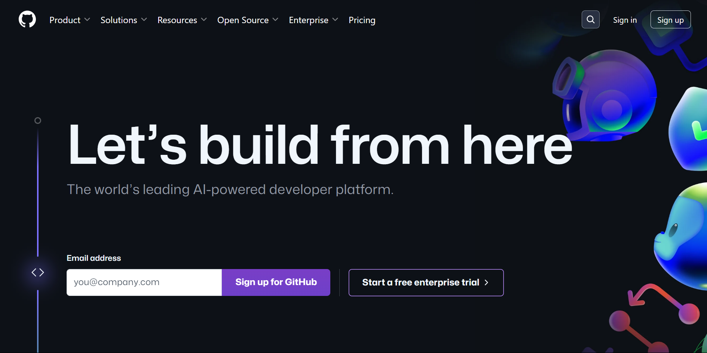

# 개발 환경 설정 가이드

부트캠프 수업 시작 전, 미리 세팅해주세요!

|                         |  C  | python | 웹 기초 | Spring | React |
| :---------------------: | :-: | :----: | :-----: | :----: | :---: |
|    github 계정 생성     |  O  |   O    |    O    |   O    |   O   |
| Visual Studio Code 설치 |  O  |   O    |    O    |   X    |   O   |
|          minGW          |  O  |   X    |    X    |   X    |   X   |
|         python          |  X  |   O    |    X    |   X    |   X   |
|      VSC extension      |  O  |   O    |    O    |   X    |   O   |

# 1. Github 계정 생성

1. [Github 홈페이지](https://github.com/)에 접속하여 회원가입을 진행합니다.

   

> **username**은 추후 변경이 불가능하니, 참고해주세요
> 이메일 인증 해주셔야 가입이 완료됩니다!
